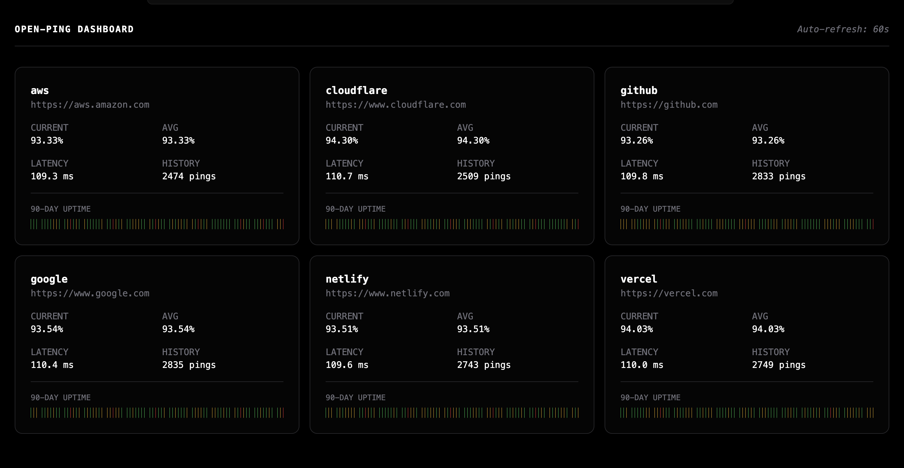

# OpenPing

**Simple self-contained uptime monitoring in Go!**

OpenPing is a lightweight uptime monitoring tool that periodically checks the availability of your URLs and logs results locally. No cloud dependencies, no sign-ups, no hosting hassle - just a single binary perfect for your Raspberry Pi or home server.



## Features

- **Lightweight** - Single binary, minimal resource usage
- **Web Dashboard** - Real-time monitoring with 90-day history visualization
- **Terminal-style UI** - Clean, minimal interface with auto-refresh
- **SQLite Storage** - All data stored locally, no external dependencies
- **Concurrent Pings** - Monitor multiple targets simultaneously
- **Color-coded Status** - Instant visual feedback on uptime health
- **Easy Configuration** - Simple JSON config file

## Installation

```bash
git clone https://github.com/asqit/open-ping
cd open-ping
make build
```

## Usage

```bash
make build    # Compile the project
make run      # Run directly
make dev      # Hot reload with air
make clean    # Remove build artifacts
```

Or use Go directly:

```bash
go run ./cmd/openping
go build -o openping ./cmd/openping
```

## Configuration

Edit `config.json` to add your targets:

```json
{
  "interval": "1m",
  "targets": [
    { "name": "google", "url": "https://www.google.com" },
    { "name": "github", "url": "https://github.com" }
  ]
}
```

## Dashboard

Access the web dashboard at `http://localhost:8080` after starting OpenPing.

**Features:**

- Real-time uptime percentage
- Average latency tracking
- 90-day uptime history visualization
- Auto-refresh every 60 seconds
- Responsive grid layout

## Project Structure

```
openping/
├── cmd/openping/        # Application entry point
├── internal/
│   ├── config/          # Configuration loading
│   ├── monitor/         # Ping monitoring logic
│   ├── server/          # HTTP server & handlers
│   └── storage/         # Database interface
├── pkg/models/          # Shared data models
├── web/
│   ├── static/          # CSS & JavaScript
│   └── templates/       # HTML templates (templ)
└── config.json          # Target configuration
```

## Tech Stack

- **Go** - Backend & monitoring
- **SQLite** - Local data storage
- **Templ** - Type-safe HTML templates
- **HTMX** - Dynamic UI updates
- **Tailwind CSS** - Styling

## Roadmap

- [x] Web dashboard with data viewer
- [x] 90-day uptime history visualization
- [ ] Notifications via email/webhook
- [ ] Custom alert thresholds
- [ ] Export data to CSV
- [ ] Docker support

## License

MIT License - see [LICENSE](LICENSE) for details
